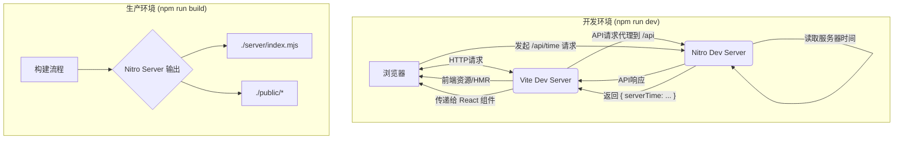

# Nitro + Vite 全栈应用开发框架

本项目是一个基于 [Vite](https://vite.dev/) 和 [Nitro](https://v3.nitro.build/) 构建的现代化全栈开发入门模板。它集成了前端渲染、后端 API 服务和灵活的部署能力，旨在提供一个高效、轻量且功能强大的开发体验。

我们在此基础上进行了扩展，集成了 **React** 作为前端组件化方案，并实现了一个简单的 **客户端路由** 和 **数据库浏览器** 功能，使其成为一个更完整的全栈应用示例。

## ✨ 功能说明

*   **全栈集成**: 后端由 Nitro 驱动，前端由 Vite 驱动，实现了无缝的开发体验。
*   **React 支持**: 集成了 React (`@vitejs/plugin-react`)，支持使用 `.tsx` 文件进行组件化开发。
*   **API 路由**: 在 `server/api/` 目录下轻松创建服务器端 API 端点。
*   **客户端路由**: 实现了一个简单的基于 `window.location.hash` 的客户端路由器，支持在不同功能页面间切换。
*   **动态组件示例**:
    *   **React 组件**: 一个调用后端 API 的 React 组件 (`ServerTime.tsx`)，展示了前后端数据交互。
    *   **原生 JS 组件**: 一个原生 JavaScript 实现的计数器 (`app.ts`)。
    *   **数据库浏览器**: 一个概念性的数据库浏览器界面 (`database-explorer`)。
*   **静态资源服务**: 高效地处理和提供静态资源。
*   **跨平台部署**: 一键构建，可将应用部署到任何支持 JavaScript 的环境中。

## 🏗️ 技术架构

本项目的核心是 Vite 和 Nitro 的结合，它们通过 `nitro/vite` 插件协同工作。



- **开发时**: Vite 作为前端开发服务器，处理页面和静态资源，并利用其代理功能将 `/api` 请求转发给 Nitro 开发服务器。
- **构建时**: Vite 和 Nitro 协同工作，将所有代码（前端和后端）打包成一个独立的、生产就绪的 Nitro 服务器。

## 🛠️ 环境配置与启动

### 开发环境

1.  **安装依赖**:
    ```bash
    npm install
    ```
2.  **启动开发服务器**:
    此命令会同时启动 Vite 和 Nitro 的开发服务器，并开启热模块替换 (HMR)。
    ```bash
    npm run dev
    ```
    服务器将运行在 `http://localhost:3000`。

### 生产环境

1.  **构建应用**:
    此命令会将您的前端和后端代码打包到一个 `.output` 目录中。
    ```bash
    npm run build
    ```
2.  **本地预览生产版本**:
    此命令会启动一个本地服务器来运行 `.output` 目录中的生产版本。
    ```bash
    npm run preview
    ```

## 🚀 部署流程

Nitro 的设计哲学是“构建一次，随处部署”。

1.  运行 `npm run build`。
2.  将生成的 `.output` 目录部署到您选择的任何平台。

Nitro 提供了对多种主流云平台的预设支持（Presets），例如 Vercel, Netlify, Cloudflare 等。您可以查阅 [Nitro 部署文档](https://v3.nitro.build/deploy) 来了解针对特定平台的详细部署指南。

例如，部署到 Vercel 通常是零配置的，您只需将代码推送到 GitHub 并连接 Vercel 即可。

## 📁 项目目录结构

```
.
├── app/                      # 前端应用代码
│   ├── components/           # React 组件
│   │   └── ServerTime.tsx    # 获取服务器时间的 React 组件
│   ├── database-explorer/    # 数据库浏览器模块
│   │   └── index.ts
│   ├── app.ts                # 原生 JS 计数器模块
│   └── main.tsx              # 应用主入口和客户端路由器
├── public/                   # 静态资源目录
│   └── favicon.ico
├── server/                   # Nitro 后端代码
│   └── api/                  # API 路由
│       ├── hello.ts
│       └── time.ts           # 提供服务器时间的 API
├── .gitignore
├── index.html                # 应用主 HTML 文件
├── package.json
├── qa.md                     # 常见问题与解决方案记录
├── README.md                 # 本文档
├── tsconfig.json             # TypeScript 配置文件
└── vite.config.ts            # Vite 配置文件
```

## 🔌 API 接口文档

### `GET /api/time`

获取当前服务器的 ISO 格式时间字符串。

- **请求示例**:
  ```javascript
  fetch('/api/time')
    .then(res => res.json())
    .then(data => console.log(data.serverTime));
  ```
- **成功响应示例**:
  ```json
  {
    "serverTime": "2023-10-27T08:30:00.123Z"
  }
  ```

### `GET /api/hello`

一个简单的示例接口。

- **请求示例**:
  ```javascript
  fetch('/api/hello')
    .then(res => res.text())
    .then(text => console.log(text));
  ```
- **成功响应示例**:
  ```
  Hello from the server!
  ```

## ❓ 常见问题解决方案

我们已将开发过程中遇到的问题及解决方案整理在 `qa.md` 文件中，以下为摘要：

1.  **Q: 为什么引入路由后页面样式丢失了？**
    - **A:** 因为路由切换时清空了整个容器，导致静态元素的样式失效。通过创建独立的动态内容“插座” (`#router-outlet`) 解决了此问题。

2.  **Q: 为什么 IDE 提示“尚未设置 ‘--jsx’”错误，但程序能正常运行？**
    - **A:** 因为 Vite 通过插件认识 JSX，但 IDE 的 TypeScript 服务需要 `tsconfig.json` 中明确配置 `"jsx": "react-jsx"`。

3.  **Q: 为什么调用 `setupApp` 时出现类型错误？**
    - **A:** 因为函数期望一个 `button` 元素但传入了 `div`。通过重构函数，使其在通用容器 (`HTMLElement`) 内部创建自己的按钮来解决。

## 🤝 贡献指南

我们欢迎任何形式的贡献！

1.  **Fork** 本仓库。
2.  创建您的特性分支 (`git checkout -b feature/AmazingFeature`)。
3.  提交您的更改 (`git commit -m 'Add some AmazingFeature'`)。
4.  将更改推送到分支 (`git push origin feature/AmazingFeature`)。
5.  开启一个 **Pull Request**。

### 代码规范

*   遵循项目现有的代码风格。
*   使用 Prettier 和 ESLint (如果配置) 来格式化代码。
*   为新功能添加适当的注释和文档。
*   确保所有类型检查通过。
